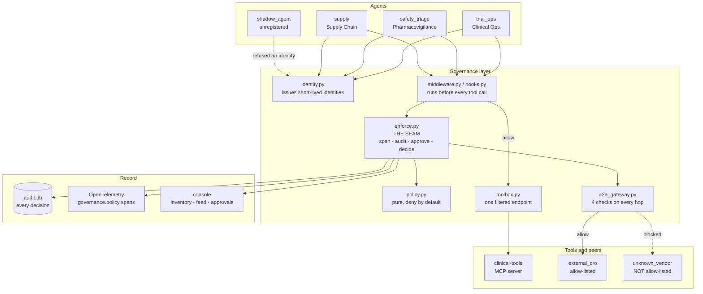

# Agent Chaos to Agent Control

The live demo for **"Agent Chaos to Agent Control: Building an Enterprise Agent Governance Layer with
Microsoft Foundry."**

A small fleet of AI agents at a fictional pharmaceutical company edits patient safety records and raises
purchase orders that nobody approved. Over four acts, a governance layer is added around them — identity,
a single tool endpoint, a policy, a delegation gateway, and a trace — until the same agents, running the
same prompts against the same tools, can no longer do any of it.

Everything here is synthetic. There are no real patients, sites, suppliers or trials, and no personal
identifiers of any kind.

---

## Quick start

Needs [uv](https://docs.astral.sh/uv/) and, for the trace UI, Docker. Nothing else — no Azure account, no
API key, no model deployment.

```bash
uv sync --all-extras --group dev   # 1. install (uv fetches Python 3.12 itself)
uv run demo doctor                 # 2. check the environment
docker compose up -d               # 3. trace UI on http://localhost:18888
uv run demo rehearse               # 4. all four acts, every decision asserted
uv run demo act1                   # 5. and away you go
```

`make act1` works too, if you have `make`. Every Makefile target is a one-line wrapper over
`uv run demo ...`, and the `uv run` form is the canonical one because `make` is not installed everywhere.

**MOCK mode is fully offline and deterministic.** No LLM, no Azure, no network. A scripted planner emits
the same tool calls every time, so every act produces the same decisions on every run. That is the stage
fallback and what attendees run. `DEMO_MODE=live` swaps in a Foundry model deployment, the Foundry
Toolbox and Entra agent identities — see [docs/LIVE_SETUP.md](docs/LIVE_SETUP.md).

### Running it in PyCharm

Open the folder, then:

1. **Set the interpreter.** *Settings → Project → Python Interpreter → Add → Existing*, and point at
   `.venv\Scripts\python.exe` (Python 3.12). `uv sync` has already created it — do not let PyCharm make
   a new venv.
2. **Pick a run configuration.** Nine are committed in `.idea/runConfigurations/`: the four acts,
   *Rehearse*, *Doctor*, *Reset*, *Console only* and *All tests*. They already use module mode
   (`-m scripts.demo_cli`), the repo root as working directory, and **Emulate terminal in output
   console**.

That last checkbox is the one that matters. Without it PyCharm's run console is not a TTY, and rich
turns off colour and clamps to 79 columns — which for a demo whose point is a colour-coded
ALLOW / DENY / APPROVE column means losing the demo. If you build your own configuration, tick it.

Belt and braces: the acts also detect PyCharm (`PYCHARM_HOSTED`) and force colour on anyway. On Windows
that needs both an ANSI colour system *and* `legacy_windows=False`, because rich otherwise paints through
Win32 console calls that vanish the moment output is redirected. `DEMO_FORCE_COLOR=1` and
`DEMO_CONSOLE_WIDTH=140` are the manual overrides for any other host.

Act 3 waits for you to click **Approve** in the browser, so run it with the console open at
<http://localhost:8787>.

---

## The four acts

| Command | Act | What happens |
|---|---|---|
| `uv run demo act1` | **Chaos** | No registry, no identity, no policy, no trace. `trial_ops` edits a PHI case and `shadow_agent` raises a 500-unit purchase order. Both succeed. |
| `uv run demo act2` | **Identity + Toolbox** | Agents get identities they cannot mint themselves. All tools move behind one endpoint that filters per caller. A v1→v2 promotion adds a tool with no redeploy. |
| `uv run demo act3` | **Enforcement** | Policy middleware before every tool call, a gateway before every delegation. Denials, one live approval you click, and a partner agent that is up, healthy and receives nothing. |
| `uv run demo act4` | **Visibility** | One request, two agents, a delegation hop and an escalation nobody answers — all under one trace id. |

Also: `uv run demo rehearse` (the pre-stage gate), `uv run demo reset`, `uv run demo console`,
`uv run demo doctor`, `uv run demo seed`.

---

## How the acts map to the five pillars

| Pillar | Act | Where it lives |
|---|---|---|
| **1. Identity** — every agent has one, issued rather than asserted | 2 | [`governance/identity.py`](governance/identity.py) |
| **2. Tool governance** — one endpoint, versioned, filtered per caller | 2 | [`governance/toolbox_server.py`](governance/toolbox_server.py) |
| **3. Policy and enforcement** — deny by default, human approval for regulated writes | 3 | [`governance/policy.py`](governance/policy.py), [`middleware.py`](governance/middleware.py) |
| **4. Boundary control** — who may delegate to whom, how deep, carrying what | 3 | [`governance/a2a_gateway.py`](governance/a2a_gateway.py) |
| **5. Observability and audit** — one trace, one record, one answer for an auditor | 4 | [`governance/telemetry.py`](governance/telemetry.py), [`audit.py`](governance/audit.py) |

Act 1 is the absence of all five. If your deck names the pillars differently, this table is the only thing
that needs editing.

---

## Architecture



**Everything funnels through one function.** The Agent Framework function middleware, the Agent Hooks
interceptor, the A2A gateway and the MOCK executor all call `enforce.apply_decision` and none of them
reimplements any part of it. That is what makes "the governance code is identical in both modes"
structurally true rather than a claim — and `tests/test_middleware.py` runs the same scenarios through
both enforcement engines and compares the results to *each other*.

### The two switches

| Variable | Values | Effect |
|---|---|---|
| `DEMO_MODE` | `mock` (default) / `live` | Swaps the identity provider, the tool source and the model client. Nothing else. |
| `GOVERNANCE_ENGINE` | `middleware` (default) / `hooks` | Which seam carries the decision. `middleware` is Agent Framework's GA `FunctionMiddleware`; `hooks` implements the [AGENT-HOOKS-0.1](https://learn.microsoft.com/en-us/agent-framework/agents/agent-hooks) contract (experimental SDK). Both produce identical decisions. |

### The policy

`config/policy.yaml` denies by default. Evaluation order, first match wins:

```
REGISTRY-000    the agent is not registered           -> deny
CATALOGUE-000   the tool is not classified            -> deny
CLEARANCE-000   the agent lacks the classification    -> deny
GRANT-000       the tool is not among its grants      -> deny
<rules>         first matching rule in policy.yaml
DEFAULT-DENY    nothing matched                       -> deny
```

The first four are structural — they come from the registry, not the rules — so a careless `allow` rule
still cannot hand a Clinical Operations agent a patient record. There is a test for exactly that.

| agent | `search_docs` | `read_case` | `update_case` | `create_po` |
|---|---|---|---|---|
| `trial_ops` | allow | deny | deny | deny |
| `safety_triage` | allow | allow | **approve** | deny |
| `supply` | allow | deny | deny | allow |
| `shadow_agent` | deny | deny | deny | deny |

`tests/test_policy.py` asserts this matrix cell by cell.

---

## Layout

```
agents/           agent runner, scripted planner, scripted chat client
governance/       registry, identity, toolbox, policy, enforce, middleware,
                  hooks, a2a_gateway, telemetry, audit, approvals, events
mcp_servers/      clinical-tools: a real FastMCP server (4 + 1 tools)
remote_agents/    external_cro and unknown_vendor: real a2a-sdk servers
console/          FastAPI + htmx governance console
config/           agents.yaml, policy.yaml, toolbox.yaml
data/             seeded synthetic fixtures (committed, deterministic)
hosting/          loopback ASGI hosting used by the servers above
scripts/          demo CLI, the four acts, rehearsal, doctor, seed
infra/            LIVE: the Foundry toolbox, and registering the agents
tests/  docs/
```

---

## Tests

```bash
uv run pytest -q          # everything, ~60s
uv run pytest -q -m "not slow"   # skip the end-to-end rehearsal
```

| File | Covers |
|---|---|
| `test_policy.py` | the full matrix, unregistered agents, classification conditions, and that a permissive rule cannot override a structural check |
| `test_identity_toolbox.py` | token issue/verify/expiry, and that the toolbox refuses a tool it did not publish **even when the client asks for it directly** |
| `test_middleware.py` | deny stops the tool (the record is unchanged), approve times out to deny, a broken guard aborts the run, and both engines agree |
| `test_a2a_gateway.py` | each of the four gateway checks on its own, plus real hops against real partner servers |
| `test_console.py` | the Approve button resolves a waiting act; an unregistered agent is flagged |
| `test_rehearse.py` | all four acts end to end — and that the rehearsal genuinely fails when a decision changes |

---

## Documentation

- **[docs/STAGE_RUNBOOK.md](docs/STAGE_RUNBOOK.md)** — pre-talk checklist, the exact command sequence,
  what to say if LIVE fails, and how to reset between rehearsals.
- **[docs/LIVE_SETUP.md](docs/LIVE_SETUP.md)** — Foundry project, model deployment, Toolbox (preview),
  registering the agents as Foundry external agents (which is also what provisions their Entra agent
  identities), Azure Monitor, env vars and rough costs. Every preview dependency is marked, and so is
  everything I could not verify.

## Licence and provenance

Built for a conference session. The synthetic data is generated by `scripts/seed_data.py` from a fixed
seed; regenerate it with `uv run demo seed`. `console/static/htmx.min.js` is vendored
([htmx](https://htmx.org/) 2.0.4) so that MOCK works with the network unplugged.
